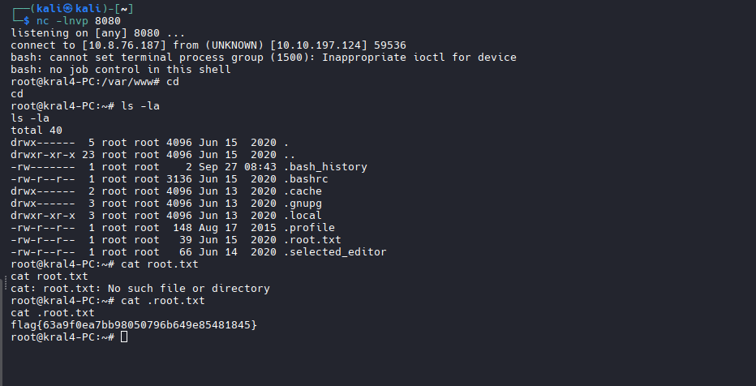

  
# TryHackMe - EASYPEASY

 
## GUÍA COMPLETA EN ESPAÑOL 

  
  
  

# Índice  
### · Reconocimiento  
### · Decodificación  
### · Esteganografía  
### · Acceso como usuario  
### · Escalada de privilegios  

## Reconocimiento

Para empezar como buenos hackers, lanzamos el siguiente comando de nmap:  

**¿Por qué este comando de nmap?**

**-A:** Activa el escaneo agresivo, que incluye:

Detección del sistema operativo (-O).
Detección de versiones de servicios (-sV).
Ejecución de scripts NSE predeterminados (-sC).
Traceroute (--traceroute).

**10.10.191.185:** La dirección IP objetivo a escanear.
**-T4:** Plantilla de temporización "agresiva":

Acelera el escaneo usando tiempos de espera más cortos.
Va del T0 (más lento/sigiloso) al T5 (más rápido/ruidoso).
T4 es rápido pero aún confiable para la mayoría de redes.

**-Pn:** Omite el descubrimiento de host (no hace ping):

Asume que el host está activo.
Útil cuando los firewalls bloquean las sondas ICMP.

 **-p-:** Escanea todos los puertos TCP (1-65535):

Sin esta opción, nmap solo escanearía los 1000 puertos más comunes.
Con -p- examina el rango completo de puertos.

Ahora lanzaré un gobuster con la wordlist common.txt (/usr/share/wordlist/dirb/common.txt) para intentar ubicar posibles directorios ocultos o vulnerables:  

**dir:** le decimos a gobuster que vamos a buscar directorios.  
**-u:** indicamos que vamos a proporcionar la URL.  
**-W:** la wordlist que vamos a utilizar.  

Vamos a curiosear en el directorio /hidden y solo encontramos esta imagen:  

Lanzamos otro gobuster sobre este directorios a ver si encontramos algo:  

Dentro de esta imagen vamos a ver el código:

## Decodificacion  

Encontramos la primera flag, pero codificada en base64: ZmxhZ3tmMXJzN19mbDRnfQ==, con el siguiente comando podemos descodificarla:

Ahora vamos a lanzar un gobuster en el puerto 65524 que es donde tenemos el apache y encontramos el directorio robots.txt, nos introducimos dentro de el y encontramos un hash:

Utilizamos un identificador de hashes, yo he utilizado uno online pero hay otra herramientas igual de válidas con hashid o haiti:

Con esto ya sabemos que el hash esta codificado en md5, con lo que sabemos que es vulnerable, a través de la página ÑADIR HASH DECODER decodificamos el hash y obtenemos la flag:

La tercera la encontre mirando el código del apache:

Mirando el código de la página, también encontramos el directorio oculto pero codificado, ahora utilizare cyberchef para la decodificación:

Estaba codificado en base62.

Ahora nos introducimos en este nuevo directorio descubierto y encontramos el siguiente hash medio oculto:

Ahora identificaremos el hash con haiti:

He ido probando en orden con John The Ripper, pero solo mostraré la foto del resultado final:

**--format:** indicamos el tipo de codificación del código que vamos a poner.  
**--wordlist:** proporcionamos la wordlist que vamos a utilizar.  

## Esteganografía  

Ahora debemos de encontrar la contraseña para ssh, después de bastante tiempo buscando opciones, decidí por intentar mirar lo archivos ocultos tras la foto de los números de la página anterior.

Accedemos a la foto:

Extraemos con stegseek usando la wordlist que nos da la room:

Y nos da la contraseña en binario:

Ahora con cyberchef decodificaremos la contraseña:

## Acceso como usuario

Ya tenemos tanto usuario como contraseña, ahora solo deberemos conectarnos por ssh y hacer cat a la flag de user:

Luego usando la herramienta online rot13, modificamos la flag para que sea la correcta:

## Escalada de privilegios

La escalada de privilegios es bastante sencilla, debemos de acceder al directorio /var/www, allí encontraremos un archivo vulnerable:

Modificamos el archivo y añadimos un script con bash para conectarnos desde otra terminal abriendo un puerto de escucha al puerto 8080:

**bash:** inicia una shell de bash.  
**-i:** activa el modo interactivo(Permite escribir comandos y ver respuestas).  
**>:** redirección de salida standar, esto significa que la respuesta del sistema va a ser redirigida.
**&:** también incluye errores.
**/dev/tcp/:** archivo especial de bash para realizar la conexión.
**8080:** puerto de escucha.
**0:** file descriptor.
**>&1:** redirige al file descriptor.

#### ¿Qué hace todo junto?

**· Inicia una shell bash interactiva.**  
**· Redirige toda la salida hacia la conexión TCP.**  
**· Redirige la entrada desde la misma conexión.**  
**· Control total de la shell a través de la red.**  

### Explicación de la escalada de privilegios

Accesdemos a /var/www (directorio del servidor).  
Encuentramos un cron job con permisos para modificarlo.  
Añadimos una reverse shell en bash al archivo.  
Lanzamos un listener en el puerto 8080 con nc -lvnp 8080.  
Cuando el script se ejecuta, obtienemos privilegios como root.  
 

